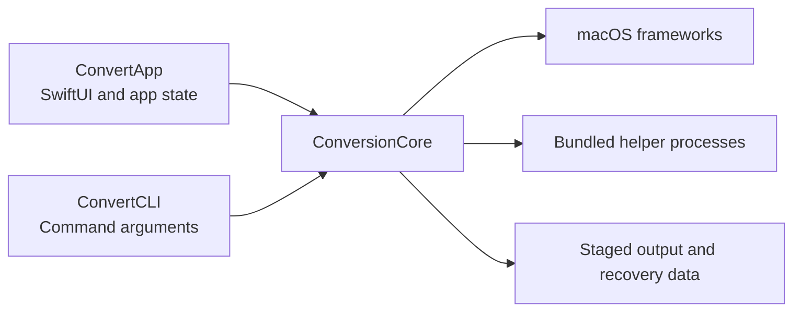
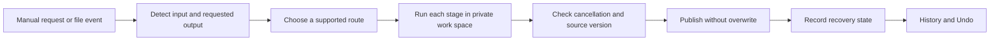

# Architecture

Allomer has one conversion core and two entry points. The native app and command-line tool call the same routing and conversion code.

## Package targets

| Target | Responsibility |
| --- | --- |
| `ConvertApp` | SwiftUI views, app lifecycle, preferences, folder selection, and user-visible state. |
| `ConvertCLI` | Command parsing and terminal output. |
| `ConversionCore` | Format detection, route selection, conversion, monitoring, recovery, and Undo. |
| `ConfigBridge` | A small C++ bridge for the pinned TOML parser. |
| `CArchive` | Declarations for the libarchive library supplied by macOS. |

`ConversionCore` must not import app code. Both entry points should receive the same behavior from the core.

## Source layout

`Sources/ConvertApp` is grouped by user feature:

- `App` owns startup, shared settings, preference keys, and disk access.
- `Automatic` owns watched-folder and rule views.
- `Conversion` owns manual conversion, conversion settings, and model workflows.
- `History` owns durable activity entries and history views.
- `Settings` owns settings screens that do not belong to another feature.

`Sources/ConversionCore` is grouped by conversion responsibility:

- `Engine` detects formats, finds routes, and executes conversion stages.
- `Automation` observes folders and schedules stable source snapshots.
- `Recovery` publishes outputs, records recovery state, and performs Undo.
- `Image`, `Media`, `Documents`, and `Data` own their format adapters.
- `Specialized` owns font, icon project, and 3D model adapters.

Add code to the narrowest folder that owns it. Split a file when separate parts change for different reasons. Do not create a new protocol or layer for one implementation.

## Conversion flow

Manual conversion writes a new destination. Automatic conversion first records enough state to restore the original. Intermediate files stay in a private directory beside the destination. The engine checks that the source did not change during conversion. Final publication must fail if another file already uses the destination name.

Recovery records are journals. A record can reconcile an interrupted conversion or Undo after the next launch. Code in this path must prefer a review state over deleting a file whose identity is uncertain.

## Concurrency

App state uses Swift Observation on the main actor. Synchronous conversion and file-system work runs in child tasks outside the UI actor. A task that can outlive one event has an owner and a stored handle. Shutdown cancels work, waits for file operations and history writes, then allows the app to terminate.

Progress crosses the actor boundary as values. Conversion code checks cancellation between stages and before it publishes a result. The FSEvents bridge is the only callback-based system boundary that needs a dispatch queue.

## Preferences and stored data

`PreferenceKey` owns every `UserDefaults` key used by the app. The string values are part of the stored-data contract. Keep an old key until its data has been migrated or can no longer occur in a supported installation.

Watched folders use security-scoped bookmark data. Conversion history and recovery journals live in Application Support. Recovery files stay beside the converted file so publication and restoration remain on the same volume.

## Dependencies

Use macOS frameworks for native capabilities. A bundled helper owns a format only when a platform framework cannot provide the required behavior. Helpers run as separate processes and ship with their source version, checksum, notices, and build record.

The app must not download a converter at run time. See [Dependency updates](dependencies.md) before changing a package, helper, or source patch.

## Verification boundaries

Swift tests cover routing, options, failure behavior, recovery, and the app model. Format check scripts compare files with independent readers where possible. Package checks prove that the built app does not use development paths. Finder events and macOS permission flows also need the manual checks in [Release checks](release-checks.md).
